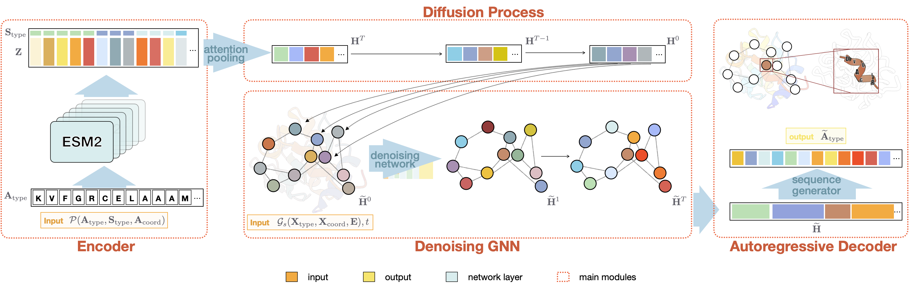

# Secondary Structure-Guided Novel Protein Sequence Generation with Latent Graph Diffusion

## 🚀 Introduction (CPDiffusion-SS)

CPDiffusion-SS is composed of three primary components: a sequence encoder, a latent diffusion generator, and an autoregressive decoder. 

The sequence encoder embeds AA sequences into a latent space of secondary structure-level (SS-level) representations, while the decoder maps the generated SS-level latent representation back to the AA space. The central module is a latent graph diffusion model that generates diverse SS-level hidden representations within the established latent space.


## 📑 Results

[//]: # (### News)

[//]: # ()
[//]: # (- [2024.06.29] our paper was accepted by ICMLw 2024 )

### Paper Results
we compare CPDiffusion-SS with both sequence and structure-based baseline methods on 10 evaluation metrics concerning the diversity, novelty, and consistency of the generated sequences. CPDiffusion0SS outperforms baseline methods on 9 out of the 10 metrics, except for the TM_new.

### Case Study
Predicted 3D structures and composition of secondary structures on three cases from the test dataset. 
Here we use red, yellow, and blue colors to represent helices (H), sheets (E), and coils (C), respectively.


## 🛫 Requirement

### Conda Enviroment

Please make sure you have installed **[Anaconda3](https://www.anaconda.com/download)** or **[Miniconda3](https://docs.conda.io/projects/miniconda/en/latest/)**.

#### step1: download ESM2
1. Manually download the ESM2 model from https://huggingface.co/facebook/esm2_t33_650M_UR50D.
2. Save the downloaded model file to the directory CPDiffusion-SS/models/esm2_t33_650_UR50D/.
#### step2: install package
1. install dssp-2.2.1
```shell
conda install -c ostrokach dssp
````
2. install biopython, torch_geometric
```shell
pip install biopython
pip install torch_geometric==2.4.0
```
3. install other packages required

## 🧬 Start with CPDiffusion-SS

### Data Process
#### 1. Prepare your dataset
you will need a dataset in pdb format
#### 2. split dataset
split the dataset and put the pdb files to "data/data_split_name/pdb"
#### 3. data process

```shell
python dataset_pipeline.py --dataset CATH43_S40_SPLIT_TRAIN_VAL
```

### Train
#### Step1:  Train Encoder-Decoder
[//]: # (if not specified, "encoder" in the source code refers to the Attention Pooling module.)
```shell
python train_encoder_decoder.py --batch_size 10 --wandb --dataset AFDB --val_num 360000 --encoder_type AttentionPooling --patience 4 --wandb_run_name decoder_ESM2_AFDB_AttentionPooling_train  --model_name decoder_ESM2_AFDB_AttentionPooling.pt
```
args: 
1. --decoder_ckpt (Optional): Train from Encoder-Decoder checkpoint.
2. --model_name: Encoder-Decoder checkpoint will be saved as results/decoder/ckpt/date/model_name

#### Step2:   Train Diffusion

```shell
python train_diff.py --wandb --wandb_run_name diffusion_CATH43S40_SPLIT --dataset CATH43_S40_SPLIT_TRAIN_VAL --decoder_ckpt './results/decoder/ckpt/20240227/decoder_ESM2_AFDB_AttentionPooling.pt' --diff_batch_size 100
```
args:
1. --wandb (Optional): delete this parameter to turn off wandb(https://wandb.ai/)
2. --wandb_run_name: run name in wandb & diffusion model saved as results/diffusion/weight/date/wandb_run_name.pt
3. --decoder_ckpt: check point of Encoder-Decoder


## 🔬 Benchmark

### Metrics

| Metric Name   | type              | Detailed information                                                                                |
|---------------|-------------------|-----------------------------------------------------------------------------------------------------|
| TM_new        | Diversity         | average pairwise TM-scores of all generated sequences                                               |
| RMSD          | Diversity         | average pairwise RMSD of all generated sequences                                                    |
| Seq. ID       | Diversity         | average pairwise sequence identities of all generated sequences                                     |
| TM_wt         | Novelty           | average TM-score between the generated protein and the most similar protein in training set         |
| ID            | Consistency       | average identities in secondary structure sequences between top10 generated proteins and the target |
| ID_max        | Consistency       | highest identities in secondary structure sequences between generated proteins and the target       |
| MSE           | Consistency       | average MSE in secondary structure compositions between generated proteins and the target     |

### Baselines
#### ESM2 & ESM-IF1
```shell
pip install fair-esm
```
see README.md in "./baselines" for more details
#### ProstT5 & ProteinMPNN
1. download source code and checkpoint files from official repositories

    ProstT5: https://github.com/mheinzinger/ProstT5

    ProteinMPNN: https://github.com/dauparas/ProteinMPNN
2. unzip source code under directory "./baselines"


### Experiments
#### package installation
```shell
 conda install -c conda-forge -c bioconda mmseqs2 -y
 conda install -c conda-forge -c bioconda foldseek -y
 conda install -c schrodinger tmalign -y
 conda install -c conda-forge pymol-open-source -y
```

#### Run
```shell
python metrics.py
```

[//]: # (## 🙌 Citation)

[//]: # ()
[//]: # (Please cite our work if you have used our code or data.)

[//]: # ()
[//]: # (```)

[//]: # (@article{tan2024ses-adapter,)

[//]: # (  title={Simple, Efficient and Scalable Structure-aware Adapter Boosts Protein Language Models},)

[//]: # (  author={Tan, Yang and Li, Mingchen and Zhou, Bingxin and Zhong, Bozitao and Zheng, Lirong and Tan, Pan and Zhou, Ziyi and Yu, Huiqun and Fan, Guisheng and Hong, Liang},)

[//]: # (  journal={arXiv preprint arXiv:2404.14850},)

[//]: # (  year={2024})

[//]: # (})

[//]: # (``)